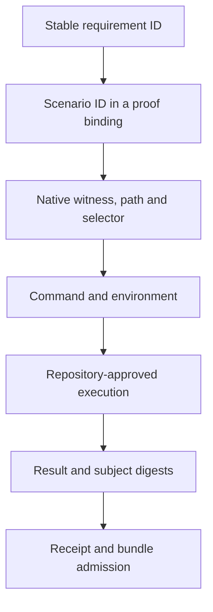
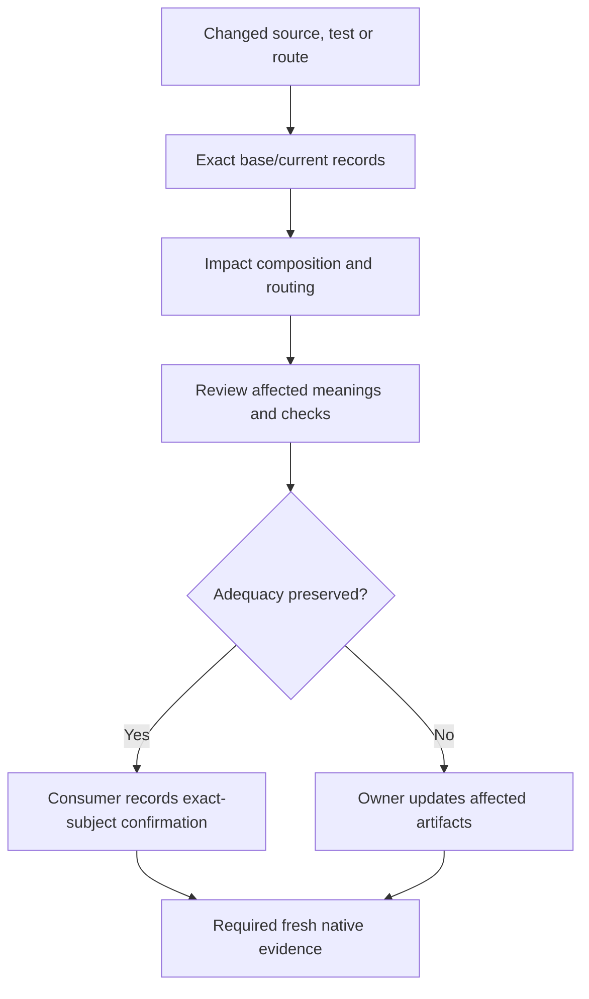

# Adoption Contract

`agentic-proofkit` is a reusable CLI and JSON infrastructure dependency for
agentic proof workflows. Consuming repositories may use it only as a mechanics
owner: it validates, renders, plans, and packages explicit caller-owned records.
It does not own product meaning, native witness execution, proof freshness,
merge admission, rollout, deployment, or production readiness.

Formal dependency-readiness predicate:

```text
external dependency ready :=
  exact package artifact identity
  and package gate evidence
  and installed CLI binary consumer contract
  and explicit rollback path
  and channel-specific authority
```

Source presence, an open pull request, a dry-run package artifact, or a GitHub
Release archive is not enough to satisfy this predicate.

## Distribution Channels

Public npm is the primary package-manager channel for JavaScript, TypeScript,
Bun, and other Node-package consumers. The npm package identity is
`@research-engineering/agentic-proofkit`; the installed CLI binary remains
`agentic-proofkit`. PyPI is the Python/uv channel after its own Trusted
Publisher and post-publish registry identity are admitted. GitHub Release
assets are archive and provenance lookup, not package-manager dependency
authority.

Consumers install the exact npm registry package identity:

```bash
npm install --save-dev --save-exact @research-engineering/agentic-proofkit
npm exec --offline -- agentic-proofkit help
```

Release evidence still uses npm as the registry-authority CLI because Proofkit
records npm-specific package identity, `dist.integrity`, `dist.shasum`, `npm
pack`, and root-only registry install proof. A bare `agentic-proofkit` command
is valid only when an installed package binary is already on `PATH`.
Equivalent exact-tarball Bun execution has not been admitted, so Bun execution
remains a non-claim.

Stable authority channel ids:

| Channel | Authority owner | Non-claims |
|---|---|---|
| `tarball_pilot` | exact local root package tarball produced by the package artifact gate | source checkout, registry release, consumer rollout |
| `registry_release` | public npm registry identity captured by the release workflow for tag `v<version>` | consumer dependency admission, native witness pass, rollout |
| `python_wheel_candidate` | platform wheels produced from the same Go CLI candidate | PyPI registry authority, consumer install proof |
| `pypi_registry_release` | PyPI JSON identity captured after publish or exact existing-byte match | consumer install proof, rollout |
| `github_release_archive` | GitHub Release asset inventory, checksums, SBOM, and retained release metadata | package-manager dependency authority |

Registry publication modes are:

| Mode | Meaning | Non-claim |
|---|---|---|
| `published_by_workflow` | the current release workflow published the candidate bytes through the admitted provider path | provider UI settings are not proven by the local report alone |
| `existing_byte_match` | the registry version already existed and byte-matched the candidate artifact | current-run publisher provenance |
| `mixed` | some files were current-run publications and others were existing byte matches | uniform provenance for every file |

When a channel claims Trusted Publisher or OIDC publication, retained evidence
must name the provider, registry, project name, repository, exact tag workflow
ref, publisher job, environment, and package identity.

## One-Dependency Infrastructure Model

Consumers should not copy Proofkit verifier logic. They should keep only
caller-owned semantic inputs and route reusable mechanics through the CLI:

```text
consumer structured records
  -> proofkit validation and reports
  -> on-demand human rendering
  -> bounded agent slices or envelopes
  -> caller-owned native witnesses and receipts
```

Proofkit may provide:

- schemas and strict JSON admission for caller-owned records;
- immutable canonical projections after admission;
- deterministic reports, view models, and loopback-only browser serving;
- requirement source, proof binding, source-set, test inventory, coverage,
  impact, selective planning, receipt, release, adoption, and scaffold
  primitives;
- bounded agent guidance packets that state required inputs, blockers,
  non-claims, and escalation points.

The consumer still provides:

- product requirement sentences and owners;
- proof-binding content and command policy;
- native witnesses and their execution semantics;
- CI producer admission policy and receipt freshness;
- credential approval, merge admission, rollout, and rollback decisions.

## Imperfect Repository Adoption

Proofkit is not limited to already-perfect repositories. Its generic
responsibility in a messy or modernizing repository is transition discipline.
It can report gaps, stale local proof owners, duplicate proof routes, orphan
tests, candidate boundaries, and migration questions. It must keep candidate
boundaries advisory until the consuming repository promotes them into stable
requirement records and proof bindings.

Safe modernization loop:

```text
caller-provided observations over code, tests, and docs
  -> proofkit inventory, gap report, and agent guidance
  -> owner-selected semantic boundary
  -> stable requirement records
  -> proof-binding contract records
  -> native tests or tools that falsify the requirements
  -> contract tests and validators for proof infrastructure
  -> admitted receipts from caller-approved producers
  -> stronger enforcement mode
```

Adoption modes:

| Mode | Use case | Proofkit role | Consumer decision |
|---|---|---|---|
| `observe` | unknown or messy repository area | inventory, gaps, questions, non-blocking guidance | whether the area is worth specifying |
| `warn` | provisional boundary | visible drift and missing-binding warnings | whether warnings block a PR |
| `enforce-touched` | stabilized touched boundary | fail closed for changed admitted owners | touched-scope completeness and receipts |
| `enforce-all` | fully admitted scope | fail closed for all admitted blocking owners | full coverage claim and rollout |

Candidate boundaries in `observe` and `warn` are advisory. Enforcement modes
fail closed while candidate boundaries remain unresolved because enforcement
requires owner-admitted requirements and proof bindings.

Pre-spec trust modes:

| Trust mode | Use case | Proofkit role | Required next owner step |
|---|---|---|---|
| `code_baseline` | no specs exist and maintainers intentionally freeze current behavior | admit caller-owned capability observations and emit bounded candidate requirement/proof-binding seeds only when scenarios have candidate ids and executable anchors | review seeds, materialize accepted `requirements.v2.json` and proof bindings, then run source, binding, inventory, and coverage gates |
| `audit_from_code` | no specs exist and maintainers do not trust current behavior | admit caller-owned observations as hypotheses, keep missing anchors as owner actions, and emit questions without failing solely on missing anchors | answer owner questions, add falsification witnesses, then materialize only accepted requirements |

`capability-map-admission` owns this pre-spec transition artifact. It does not
replace `requirement-authoring-plan`: capability maps produce seeds from
observed capabilities, while authoring plans compose owner-reviewed candidate
updates into a non-authoritative requirement-source preview and transition
check. Durable truth still starts only after the consumer commits and admits
`requirements.v2.json`.

Before authoring a capability map, run `agentic-proofkit capability-map-admission --help`.
The same command in npm and Python installations provides complete synthetic
audit and baseline examples, field relationships, and candidate-only limits.
Replace example facts with reviewed observations; missing tests must remain
missing, not be invented to satisfy baseline admission. The guide is available
on demand and is not an exhaustive nested schema or execution authorization.

## First Adoption Loop

Proofkit can reduce initial adoption glue, but it must not turn observation into
truth. Start with one explicit trust intent:

```bash
npm exec --offline -- agentic-proofkit adopt plan --mode fresh --repo-root .
npm exec --offline -- agentic-proofkit adopt plan --mode code-baseline --repo-root .
npm exec --offline -- agentic-proofkit adopt plan --mode audit-from-code --repo-root .
```

The command validates its arguments before filesystem access, scans only a
fixed catalog of recognized files at the selected root, and emits a
candidate-only task sequence plus a compact reference to the native-evidence
guidance owner. It does not parse those files, infer a stack, inspect arbitrary
source code, generate product requirements, write files, or run witnesses.
An optional `--stack <preset-id>` records a caller-selected suggestion and
cannot alter source trust or task semantics.

Continue the first loop as follows:

```text
caller-owned capability or test observations
  -> candidate-only Proofkit reports
  -> owner review and materialization
  -> strict requirement source, proof binding, and test inventory admission
  -> coverage view from explicit admitted facts
```

Use `test-evidence-inventory --projection discovery-draft` only for explicit
caller-owned test discovery facts. The command does not scan repositories,
execute tests, emit execution-backed semantic evidence, or close coverage. It emits
candidate inventory guidance with a non-strict candidate authority so an agent
can ask the right owner questions and materialize strict inventory rows later.
Candidate inventory diagnostics are rejected by strict inventory admission until
the consumer rewrites them into owner-reviewed `caller_owned_inventory`.

Use `requirement-coverage-input-compose` when the consumer already has explicit
requirement source, proof binding, test inventory, coverage universe, and local
environment policy records. The command may compose from direct child records
or from previously normalized records, but it must reject failed child reports
instead of repairing semantics.

Use `witness-plan` with a `projection: "requirement-bindings"` input only when
the proof binding already contains safe witness command facts and the caller
provides witness command vocabulary. The projection avoids duplicated command
identity; native execution and command freshness remain caller-owned.

## Portable Agent Bootstrap

`REQ-PROOFKIT-WORKFLOW-016` through `REQ-PROOFKIT-WORKFLOW-018` own the bounded
Phase5A generation/check contract. Use `integration source --tool codex` or
`integration source --tool claude` through a repository-approved, already
installed launcher. JSON is the default and includes the exact generated
content, descriptor-owned target path, materialization identity, content and
consumed-capability digests, and separate metadata/body byte counts. Text is
the exact file content. The limits are 512 metadata bytes and 4096 body bytes,
not tokenizer-specific token counts.

The fixed repository paths are `.agents/skills/agentic-proofkit/SKILL.md` for
`codex` and `.claude/skills/agentic-proofkit/SKILL.md` for `claude`. Neither tool
is selected implicitly; selecting one does not inspect the other location.
The generator reads no repository files, writes nothing, and has no `--output`
or install option. Generated instructions contain no hooks or permission grants
and delegate policy, planning, and evidence semantics to current owners.
Resolve the approved installed launcher for each session. An absent or
ambiguous binding needs an owner decision, not an install, network fallback,
package-manager default, or persisted machine-local executable path.

For managed installation, select the tool and root explicitly, inspect the
plan, then apply its exact transaction and desired-state identities. The
following example assumes a repository-approved, already installed npm
launcher; other approved carriers expose the same logical routes. Replace the
root and identity placeholders with the reviewed plan's values.

```bash
npm exec --offline -- agentic-proofkit integration plan --tool codex --operation install --repo-root /absolute/inspected/repository --format text
npm exec --offline -- agentic-proofkit integration apply --tool codex --operation install --repo-root /absolute/inspected/repository --expect-transaction <reviewed-transaction-sha256-ref> --expect-desired-state <reviewed-desired-state-sha256-ref>
npm exec --offline -- agentic-proofkit integration check --tool codex --repo-root /absolute/inspected/repository
```

`REQ-PROOFKIT-WORKFLOW-019` owns managed file lifecycle. Use `--operation
update` or `--operation remove` with a fresh reviewed plan for those operations.
The fixed bootstrap and `proofkit/integrations/<tool>.v1.json` baseline share
one native transaction. Local byte or mode edits are conflicts, not overwrite
permission. An exact current manually exported bootstrap can be enrolled by
install; an unknown or stale unbaselined file requires an owner decision.
The baseline records exact cooperative before-state, not authenticated origin.
Removal deletes selected managed files only, leaving their directories and
adjacent instructions. It does not archive or replace instructions with an
empty file. Baseline-only removal can clean a valid orphan baseline.

In the standalone native CLI, transaction plan/apply/recover and residue
maintenance routes register SIGINT/SIGTERM handling after argument admission
and input reading. A handled signal requests cooperative cancellation; the
native owner still determines recovery, output and exit status. Handling is
then restored independently of native work or output returning, so a later
signal can terminate a normally configured process even during blocked I/O.
Signals may coalesce before restoration. Forced termination can lose or truncate
the acknowledgement without undoing committed files. This is not a hard
cancellation deadline or a guarantee about package launchers or proof tools.

After interruption, use `integration recover --repo-root <root> --transaction
<pending-sha256-ref> --action <resume|rollback>`. It uses the existing native
journal, not the current bootstrap source. A completed recovery is historical
evidence; inspect current files separately. Desired-absence journals and new
identity-bound terminal receipts use schema v2 and require this or a later
supporting binary. Finishing recovery alone does not establish downgrade
compatibility; no automatic downgrade or control-state deletion is supported.

New transactions prepare their complete journal in a private
`.agentic-proofkit/transaction-residue/preparing-*` directory before publishing
the active transaction. Interrupted unpublished preparation is retained there,
does not block a later plan and is never automatically resumed or removed.
An error after active publication preserves the known journal for recovery.
Older empty or incomplete active state may lack a recoverable transaction ID:
do not invent an ID or delete unknown entries to bypass the failure. The explicit
repository transaction maintenance routes inspect and retain this evidence:

```bash
npm exec --offline -- agentic-proofkit transaction inspect-residue --repo-root /absolute/inspected/repository
npm exec --offline -- agentic-proofkit transaction quarantine-residue --repo-root /absolute/inspected/repository --expect-observation <reviewed-observation-sha256-ref>
```

Inspection never writes. An absent active directory returns `absent` with
`observationId: null`; eligible private empty or bounded partial preparation
returns `eligible` and a SHA256 observation. Recognized journals, unsafe or
unsupported entries and invalid coexisting terminal state reject, not classify
as eligible. No raw journal, repository path or inferred transaction ID is
returned. Unknown bytes are not evidence of zero historical effects.

Quarantine takes the existing exclusive lease, requires the exact current
observation and relocates the entire active directory by one same-filesystem
rename to `.agentic-proofkit/transaction-residue/quarantined-<observation-hex>`.
The token binds native root/control/active identities, modes, numeric user
ownership, admitted child bytes and coexisting terminal state. It is a freshness
precondition, not authenticated provenance. Bytes, modes, directory/file
identities and retained receipts are preserved. An occupied destination rejects
before inspecting a new active source, so retry after lost acknowledgment never
moves a replacement active directory. No copy, merge, rewrite, deletion, guessed
identity, rollback or transaction receipt is involved. Planning can proceed
after a successful move but neither planning nor recovery consumes the archive.

Both commands require `--repo-root`, accept no input or stdin, default to JSON
and support `--format text` with optional `--color auto|never` (default `never`).
All flags and the quarantine SHA256 reference are admitted before repository
I/O. Success exits 0 with one closed version-1 observation and fixed non-claims.
Operational, stale, unsupported and outcome-unverified failures exit 1 on stderr
without a success JSON packet. An error after rename can leave evidence already
moved; inspect retained state before deciding what to do, and never treat an
error as a no-mutation guarantee. An earlier failure can leave an empty private
residue parent. Unresolved state requires its owner's decision, not blind retry
or control-state deletion. Archive disposal needs separate authority.

These operations do not prove power-loss durability or protect against
non-cooperative same-user modification.

Present-only v1 journals and historical v1 receipts remain readable. A legacy
receipt does not bind its missing desired identity: replan before applying.
Repeated apply checks that the retained applied transaction binds the exact
current desired state under one native lock; pending work blocks replay.

Plan and apply default to JSON. Ready plans and passed receipts exit 0;
classified conflicts, recovery, cleanup or durability outcomes exit 1 with a
report and empty stderr. Invocation and operational failures use stderr.
`--format text --color auto` colors labels only on a capable TTY without
`NO_COLOR`; the default is uncolored. Check never repairs files.
The checker admits flags before I/O and reads only the selected fixed path
through an application-write-free confined lease with bounded reobservation.
Exit 0 and `current` mean exact generated-byte equality; exit 2 reports
`missing`, `stale`, or `invalid`; exit 1 reports an invocation or operational
error, including denied reads, ambiguous paths, observed changes, cancellation,
or cleanup failure. It never prints observed bytes, their digest, or caller
root paths. Source exits 0 on successful generation and 1 on error.

Generated identity binds the shared template, selected descriptor, and exact
consumed registered public invocation contracts. Package version is absent
from the generated bytes; version-only or unrelated-command changes preserve
identity when consumed projections remain unchanged. Shared native source
digests may conservatively invalidate freshness. This is materialization
freshness, not proof of every transitive runtime behavior.

Managed file lifecycle is not proof of host activation. Installed npm/Python
integration proof requires actual carrier execution; source-only tests do not
discharge it. Native-host file discovery, body loading, and approved-launcher calls
are separate observations requiring isolated sessions and absent/altered-file
controls; a prompt directly requesting CLI execution is not skill-use evidence.
Removing a file does not revoke instructions already loaded into host context.

## Requirement, Contract, And Test Order

The durable semantic source is the repository-owned requirement package:
human context in `overview.md` plus machine-admissible `requirements.v2.json`
records. The overview explains context; it does not create uncited durable
truth.

The public source contract requires `schemaVersion: 2`, grouped requirement
records, and the matching `specPackagePath/overview.md` and
`specPackagePath/requirements.v2.json` paths. The former flat v1 source is not
an active public reader. Changing a version number or filename alone does not
migrate a source, its references, or its proof bindings.

Canonical field correspondence and accepted input domains are separate checks.
The v2 source and its expanded projections each have explicit resource bounds.
Admission of source bytes does not imply that every derived view or browser
response fits its own bound. A consumer migration must check those limits and
all affected commands; binding IDs alone do not supply scenario bodies or
native test results.

Proof bindings are verification-route contracts. They answer which scenario,
witness, command, environment class, and receipt policy can falsify or support
a requirement. Native tests and tools own executable verification procedures
and observed result semantics. Contract tests and validators prove the proof
infrastructure itself is coherent.

For a route that actually runs:



This is an authoring and execution route, not automatic test generation or a
transfer of semantic authority. A requirement may have several scenario and
witness routes; a native test may reference several requirements. Keep logical
IDs stable when a test is renamed or an implementation changes language, and
review the changed native bindings. Public bindings carry scenario identity
and routing, not a complete language-independent scenario body.

Read the two kinds of result separately:

| Question | Current result and boundary |
|---|---|
| Which declared tests and routes reference a requirement? | `requirement-coverage-input-compose` prepares `requirement-coverage-view` input from requirements, proof bindings and test inventory. The resulting coverage is declaration lookup, not execution evidence or proof that a test is an adequate falsifier. |
| What was recorded for a run, and is the record usable? | `proof-receipt-admission` and `spec-proof-bundle-admission` validate supplied records and linkage. Use the separate currentness, producer and trust owners under consumer policy. Structurally admitted records can describe failed, blocked or not-run attempts; admission does not authenticate a producer or approve a change. |

For the exact input recipes, ask the installed CLI rather than maintaining a
second copy of its JSON fields:

```sh
agentic-proofkit requirement-authoring-plan --help
agentic-proofkit native-evidence-guidance --help
agentic-proofkit proof-receipt-admission --help
agentic-proofkit spec-proof-bundle-admission --help
agentic-proofkit requirement-coverage-input-compose --help
agentic-proofkit receipt-currentness-scope --help
```

The authoring guide connects candidate materialization; native guidance names
the repository-specific check and evidence obligations. Receipt and bundle
guides distinguish actual observations from missing operands. Their deliberately
incomplete templates must not be filled with invented success or provenance.

Formal authority order:

```text
Requirement source owns meaning.
Proof binding owns verification route.
Native test or tool owns executable falsifier.
Contract test owns infrastructure consistency.
Receipt owns recorded run facts and provenance.
Merge policy owns admission.
```

Logical creation order for an accepted invariant:

1. Create or update the stable `REQ-*` record.
2. Create or update the proof-binding contract that maps the requirement to
   witness obligations, command ids, environment class, and receipt class.
3. Add or update native tests or tools that can falsify the requirement.
4. Add or update Proofkit contract tests only when the proof infrastructure
   itself changed.
5. Admit receipts only from caller-approved producers.

Tests are not primary semantic authority. A test can prove an invariant only
when the requirement and proof-binding route make the tested obligation
explicit. Some high-level context can remain explanatory, but durable
`must`, `shall`, `guarantee`, or readiness claims must resolve to stable
requirement records or be rejected by the consuming repository's policy.

Change impact runs in the other direction: a changed requirement, binding,
test path, command or environment can require review of affected routes.
`requirement-impact-input-compose` and `impact` use explicit base/current
records and caller-supplied change facts. The consumer must confirm continued
adequacy or update the affected artifacts; tests must not silently redefine
requirements. These commands do not infer semantic equivalence, implement a
persistent approval store or require meaningless edits to unchanged artifacts.

### Native Traceability Cookbook

The installed CLI contains the recipe and repository-specific adapter checklist:

```sh
agentic-proofkit native-evidence-guidance --help
```

It connects the existing authoring template, full binding graph, native
discovery, receipt admission and reverse-impact review without a documentation
lookup or a new runner. Normal JSON and text guidance stay bounded to their
existing slots; the longer recipe is loaded only on explicit help.

The coverage guide connects the original source, binding and inventory inputs
to the coverage composer and then its exact output to the view. Composer success
does not mean coverage passed: retain the downstream failures, unmapped tests
and declared dead zones. Currentness has a separate input guide that binds the
original receipt's recorded subjects to independently captured current subjects.
It does not discover files or authenticate supplied hashes; an inapplicable
scope is not a current passing test. Both templates deliberately reject until
the consumer supplies their missing operands.

Start with one owner-reviewed promise, such as rejecting an empty request.
The connected `adopt materialize plan --help` example supplies its requirement,
scenario and witness records. Replace fictional paths, selectors, command and
environment with actual repository facts. Run declaration checks before any
write planning; their success is not evidence that the test exists or ran.

| Step | Consumer-owned action | Observation to retain |
|---|---|---|
| Establish the route | Bind the stable requirement/scenario/witness tuple to native discovery, a path/selector and command/environment. | Every retained edge resolves; missing, unmapped and excluded tests remain explicit. |
| Exercise behavior | Run the approved native check on a known-good implementation, then on one accepting the empty request. | The positive passes; the near miss fails the intended assertion, even if the declaration graph is unchanged. |
| Exercise linkage | Remove a discovered test, then add a test with no admitted route. | The consumer linkage check identifies the missing and unmapped cases; it does not count them as passes. |
| Exercise freshness | Keep the old receipt and change one bound source, test, command or environment operand. | The old success remains a historical observation and fails the currentness predicate. |
| Restore | Restore the known-good subject and regenerate inventory before fresh execution. | Independent expected edges and the positive outcome are recovered. |

Stable references may live beside native tests while inventories are derived.
Do not duplicate a scenario's behavioral description in an editable inventory.
A separate scenario document is justified only when it owns independently
meaningful behavior; a binding's `scenarioId` alone is not that description.
Native framework selectors and parameter instances are not portable scenario
identities. Keep all matching requirement/witness edges for a shared scenario,
and require an explicit consumer mapping when a selector or wrapper path is
ambiguous. Proofkit's public structured graph preserves declared routes; it does
not discover native tests or judge their assertions.

Choose scenario storage by the meaning it must own, not by a mandatory extra
document layer:

| Candidate | Appropriate boundary | Cost or limitation to review |
|---|---|---|
| Separate scenario document | Independently meaningful portable conditions or examples with their own review lifecycle. | Another normative artifact, reference closure and freshness policy; do not repeat the same promise. |
| Scenarios inside the specification | Portable scenario meaning owned with the requirement. | Public grouped source v2 admits typed scenario bodies and requirement membership; a reference-only binding without a source body does not gain portable behavior, execution, or assertion authority. |
| Structured native declarations | Stable references, parameter instances and executable expected observations near the native check. | Derive the inventory and require review when assertions or qualified links change; native expectations cannot silently redefine intent. |
| Test-adjacent annotations | References attached to a framework-owned test declaration. | Parse the actual native declaration association; comments alone do not prove discovery, execution or assertion quality. |

Prefer the existing source plus structured native declarations when it expresses
the required workflow. A separately editable scenario store is not necessary
just to connect IDs. Reconsider it when portable scenario meaning cannot be
expressed without losing a required distinction. This is not a universal format
or human-usability ranking; measure the complete input, edit and maintenance
cost for the consuming repository.

Use `requirement-context-compose --help` for the connected catalog/tree recipe
and canonical source/binding snapshot. Before committing, a confirmation must
cover the publication plane actually being approved. Checking working files
does not approve different index bytes; `change plan --help` explains this
consumer-owned precondition. Neither command installs a Git hook or grants
approval authority.

Reverse review is distinct from the forward execution route above:



`requirement-impact-input-compose` and `impact` own routing, not the confirmation
store or the consumer's selection of fresh checks. This cookbook is a bounded
workflow template, not a shipped native-discovery adapter or universal test
completeness claim. A language migration must preserve observed promises while
reviewing native adapters and evidence again; stable IDs do not prove parity.

## Rendering And Browser Views

After reviewing and applying the candidate project with `adopt materialize
plan` and `adopt materialize apply`, inspect it without composing browser JSON:

```sh
agentic-proofkit status --repo-root .
agentic-proofkit view --repo-root . --serve
```

Only `--open` opens the local browser. Without `--serve`, `view` returns a
bounded JSON plan and opens no listener. For a single question use `--serve
--open --session-mode one-shot-question`; the terminal packet follows server
cleanup. `--session-timeout-seconds` is optional, bounded to 1..7200 and valid
only in that one-shot mode. Serving does not accept `--json-layout`.

`view` requires a complete, current, structurally admitted materialized
project. Other states direct the caller to `next` with the same explicit root;
they do not trigger repair or materialization. The single captured project
provides specifications and declared proof relations, not native proof results.
Coverage and semantic diff are unavailable without their own evidence inputs.
The browser remains bound to that capture when live files change. Viewing does
not change `verification_required` into verified. Existing
`requirement-browser-server` routes remain available for explicitly composed
source, proof, coverage, tree or comparison workspaces.

Rendered HTML, Markdown, lookup graphs, and browser views are presentation
products. They should be generated on demand from explicit caller-owned inputs
unless a consumer explicitly admits a small tracked artifact with a freshness
gate.

Hierarchical rendering must use explicit input:

```text
meta spec
  -> module spec
  -> optional submodule spec
  -> presentation-only tree/view/export
```

Proofkit may render this tree, filter IDs, show linked test scenarios, or
export Markdown/HTML. It must not infer the hierarchy from ambient paths or make
rendered output canonical truth.

## Agent Guidance

Machine-facing reports should provide bounded prompts for coding agents when
that reduces ambiguity. A prompt-like action must identify:

- observed fact;
- uncertainty;
- owner or escalation target;
- exact files, ids, or selectors to inspect;
- candidate action;
- proof command or missing witness;
- non-claim that prevents the guidance from becoming semantic authority.

Agents must stop instead of guessing when ownership, proof freshness, producer
admission, native witness execution, or merge admission is outside Proofkit's
authority.
