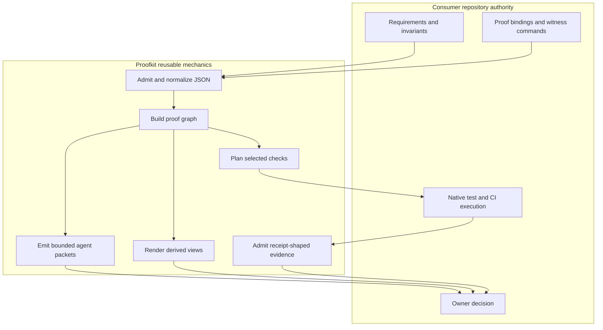
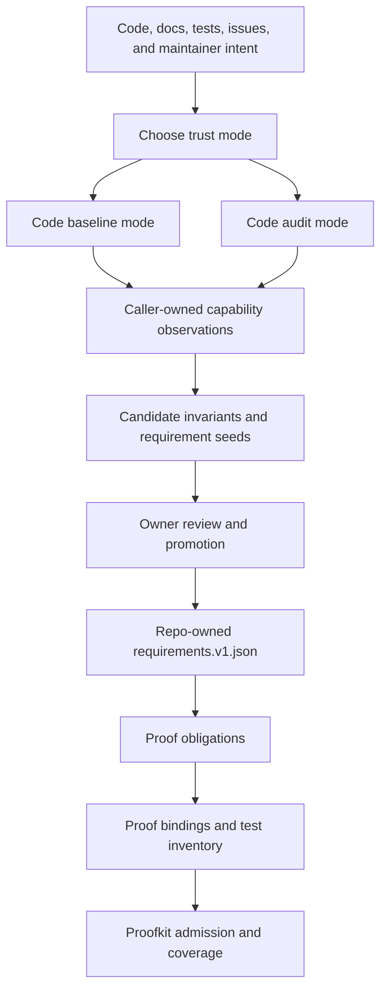

# agentic-proofkit

Reusable CLI and JSON proof infrastructure for spec-to-proof workflows in
software repositories.

`agentic-proofkit` helps repositories validate structured requirements, bind
requirements to proof routes, plan selective checks, admit receipt-shaped
evidence, render human views, and give coding agents bounded next-action
packets without copying verifier logic between projects.

## Current Repository State

| Surface | State |
|---|---|
| Source repository | Declared in package metadata; provider visibility is a live GitHub fact |
| Current layer | Public-source workflow; release evidence is version-specific |
| Runtime implementation | Go CLI with npm and Python wrapper packaging |
| Package release | Scoped npm release channel configured; exact version and registry identity are owned by npm and GitHub Release artifacts |
| Public-source provenance | Claimed only for a version whose release assets, registry identity, and checksum manifests are artifact-closed |
| License | MIT |

## Install

The canonical registry identity is npm:

```bash
npm install -D @research-engineering/agentic-proofkit
```

Bun consumers may install the same npm registry package with Bun:

```bash
bun add -d @research-engineering/agentic-proofkit
```

npm remains the release-authority toolchain because release proof records npm
registry identity, `dist.integrity`, `dist.shasum`, `npm pack`, and root-only
registry install evidence. Bun is a supported consumer/developer package
manager path, not a replacement for npm release evidence.

Python consumers use the Python package as a runner wrapper over the same Go
CLI, not as a Python SDK. Python projects should still treat CLI/JSON records,
exit codes, and package metadata as the public contract.

## Project Boundary

`agentic-proofkit` is intended to provide reusable proof-workflow mechanics for
repositories that want explicit requirements, proof bindings, deterministic
reports, and bounded guidance for coding agents.

Proofkit does not own a consuming repository's product requirements, native
witness execution, receipt authenticity, proof freshness, merge admission,
rollout, deployment, or production readiness.

## How It Works

Proofkit has two related but separate loops:

- an **authoring loop** for turning observations into candidate invariants and
  repo-owned specifications;
- a **proof loop** for admitting those specifications, binding them to evidence,
  and producing derived views or bounded next actions.

The loops are separate because generated observations are not product truth.
Only the consuming repository can promote a candidate invariant into an
admitted requirement.

### Proof Loop



The core invariant is separation of authority. The consuming repository owns
what the product must do and which native checks prove it. Proofkit owns the
reusable mechanics: admitting structured inputs, preserving provenance,
checking proof-binding shape, planning bounded verification, rendering derived
views, and returning agent-readable next-action packets.

The diagram keeps the rendering syntax intentionally simple for GitHub README
compatibility. Requirements, bindings, witness commands, native execution, and
final decisions stay in the consumer repository. Proofkit outputs are admitted
reports, plans, views, receipts, or agent packets; they do not become product
truth unless the consumer explicitly admits them.

### Invariant Authoring Loop

For a repository with no specification, Proofkit can guide an agent through two
different starting modes:



| Mode | Use when | Result |
|---|---|---|
| Code baseline | Current behavior is accepted as the starting contract | Candidate requirements and bindings that preserve current behavior until owners review them |
| Code audit | Current behavior may be wrong or incomplete | Untrusted observations and questions that must be promoted by a repository owner before becoming requirements |

In both modes, generated records remain candidates until the consuming
repository admits them as repo-owned requirements, proof bindings, and witness
plans. Proofkit can structure and validate candidate packets, but it does not
extract complete behavior from arbitrary source code, invent product policy, or
make generated invariants authoritative by itself.

## Start Here

Use the CLI help route before reading source:

```bash
agentic-proofkit help
agentic-proofkit init
agentic-proofkit help repo-profile-admission
agentic-proofkit repo-profile-admission --help
```

Command-specific help is derived from the private command descriptor table and
does not read stdin. The full machine-readable command inventory remains
`proofkit/cli-contract.v1.json`; the human route map is
`docs/proofkit-contract-map.md`.

| Repository state | Minimal first route | Stop condition |
|---|---|---|
| Unknown starting point | `init` | Stop before reading repository files, writing files, or treating route guidance as proof |
| Fresh repository with no specs and no extracted observations | `init --preset fresh`, then `scaffold-project-structure` or `gradual-adoption-bootstrap` | Stop before writing files or inventing requirement meaning |
| Current code is trusted as the initial contract | `capability-map-admission` with `trustMode: "code_baseline"` | Stop before treating generated seeds as admitted requirements |
| Current code must be audited before it becomes a contract | `capability-map-admission` with `trustMode: "audit_from_code"` | Stop at owner questions and candidate-only records |
| Legacy repository has local proof infrastructure | `migration-parity-admission`, then `migration-plan` | Stop before deleting local proof owners without parity evidence |
| A change set needs bounded checks | `changed-path-set`, optional `impact`, then `selective-gate-plan` and `selective-gate-evidence` | Stop on unknown scope, missing routes, or stale receipts |

Use `secret-scan` only when the caller provides an explicit file inventory with
content. It is a dedicated secret-like text detector for admitted inventory
records; it does not traverse the repository, validate credential liveness, or
replace provider secret scanning.

For TypeScript consumers that want a small wrapper instead of hand-written
child-process code:

```bash
agentic-proofkit json-report-cli-adapter-source --language typescript --format json
```

The generated adapter remains caller-owned after materialization. It must be
reviewed, pinned to the installed package, and kept behind the same CLI/JSON
contract; it does not become a separate public SDK or proof authority.

| Need | Owner |
|---|---|
| Human orientation | This README |
| Coding-agent startup | `AGENTS.md` |
| Adoption and release-channel model | `ADOPTION.md` |
| Active work ledger | `BACKLOG.md` |
| Contribution rules | `CONTRIBUTING.md` |
| Vulnerability reporting boundary | `SECURITY.md` |
| Explicit boundary denials | `NON_CLAIMS.md` |
| `LICENSE` | MIT license |

## Non-Claims

This README is a human landing page. It is not a CLI contract, release proof,
package publication claim, security audit, or consumer readiness claim. CLI and
package behavior are owned by their source, tests, machine-readable contracts,
and release evidence, not by this overview.
