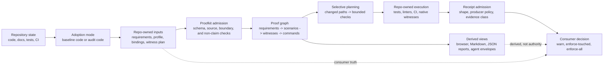

# agentic-proofkit

Reusable CLI and JSON proof infrastructure for spec-to-proof workflows in
software repositories.

`agentic-proofkit` helps repositories validate structured requirements, bind
requirements to proof routes, plan selective checks, admit receipt-shaped
evidence, render human views, and give coding agents bounded next-action
packets without copying verifier logic between projects.

## Current Repository State

| Surface | State |
|---|---|
| Source visibility | Public |
| Current layer | Public source; release evidence is version-specific |
| Runtime implementation | Go CLI with npm and Python wrapper packaging |
| Package release | Scoped npm release channel configured; exact version and registry identity are owned by npm and GitHub Release artifacts |
| Public-source provenance | Claimed only for a version whose release assets, registry identity, and checksum manifests are artifact-closed |
| License | MIT |

## Project Boundary

`agentic-proofkit` is intended to provide reusable proof-workflow mechanics for
repositories that want explicit requirements, proof bindings, deterministic
reports, and bounded guidance for coding agents.

Proofkit does not own a consuming repository's product requirements, native
witness execution, receipt authenticity, proof freshness, merge admission,
rollout, deployment, or production readiness.

## How It Works

The core invariant is separation of authority. The consuming repository owns
what the product must do and which native checks prove it. Proofkit owns the
reusable mechanics: admitting structured inputs, preserving provenance,
checking proof-binding shape, planning bounded verification, rendering derived
views, and returning agent-readable next-action packets.

For a repository with no specification, Proofkit can guide an agent through two
different starting modes:

| Mode | Use when | Result |
|---|---|---|
| Code baseline | Current behavior is accepted as the starting contract | Candidate requirements and bindings that preserve current behavior until owners review them |
| Code audit | Current behavior may be wrong or incomplete | Untrusted observations and questions that must be promoted by a repository owner before becoming requirements |

In both modes, generated records remain candidates until the consuming
repository admits them as repo-owned requirements, proof bindings, and witness
plans.

## Start Here

| Need | Owner |
|---|---|
| Human orientation | This README |
| Coding-agent startup | `AGENTS.md` |
| Adoption and release-channel model | `ADOPTION.md` |
| Active work ledger | `BACKLOG.md` |
| Contribution rules | `CONTRIBUTING.md` |
| Vulnerability reporting boundary | `SECURITY.md` |
| Explicit boundary denials | `NON_CLAIMS.md` |
| `LICENSE` | MIT license |

## Non-Claims

This README is a human landing page. It is not a CLI contract, release proof,
package publication claim, security audit, or consumer readiness claim. CLI and
package behavior are owned by their source, tests, machine-readable contracts,
and release evidence, not by this overview.
