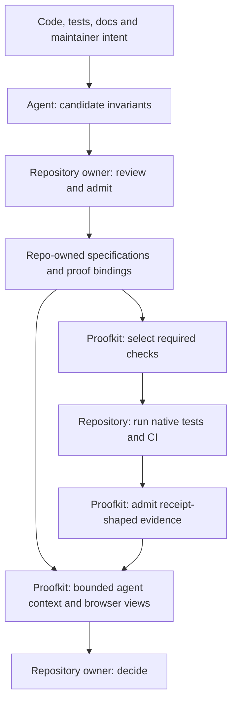
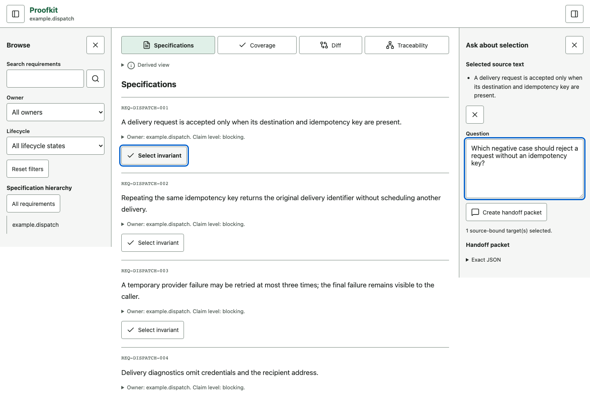

# agentic-proofkit

Machine-readable specifications, proof bindings, selective verification,
and bounded agent workflows for software repositories.

Keep product promises in repo-owned requirements. Connect each requirement to
the checks that can falsify it. Give agents the relevant context and next action;
inspect the same records in a local browser. Your repository retains authority
over requirement meaning, native tests and approval.

## Install

```bash
npm install --save-dev --save-exact @research-engineering/agentic-proofkit
```

Pre-1.0 releases may contain owner-declared breaking changes, so npm consumers
must retain the exact saved version instead of replacing it with a version
range.

For an existing repository without an admitted specification, start with a
read-only adoption plan:

<!-- proofkit:first-action:start -->
```bash
npm exec --offline -- agentic-proofkit adopt plan --repo-root . --mode audit-from-code --format text
```
<!-- proofkit:first-action:end -->

The plan returns authoring tasks and owner questions. It reads only a fixed
root-file catalog; it does not analyze arbitrary source semantics, write a
specification or run tests. An agent must inspect the selected code and design
repo-specific checks with the owner. `--repo-root .` selects the repository;
`--offline` resolves the already-installed dependency.

Before opening a project in the browser, review the candidate artifacts and
follow the separate [materialization workflow](docs/proofkit-contract-map.md#agent-decision-procedure):
`adopt materialize plan`, then explicit `adopt materialize apply` with both
reviewed transaction and desired-state identities. Planning alone does not
create that project.

## How It Works


```mermaid
flowchart TB
    Observations["Code, tests, docs and maintainer intent"] --> Candidates["Agent: candidate invariants"]
    Candidates --> Review["Repository owner: review and admit"]
    Review --> Specs["Repo-owned specifications and proof bindings"]
    Specs --> Checks["Proofkit: select required checks"]
    Checks --> Native["Repository: run native tests and CI"]
    Native --> Evidence["Proofkit: admit receipt-shaped evidence"]
    Specs --> Views["Proofkit: bounded agent context and browser views"]
    Evidence --> Views
    Views --> Decision["Repository owner: decide"]
```

**Authoring is not proof.** Observed behavior and generated invariants remain
candidates until the repository owner admits them. Binding a test declares a
proof route; only its actual execution can supply execution evidence. Reports
and views do not authenticate receipts or approve a change.

### Choose What You Trust

Select the mode explicitly; Proofkit does not infer that existing code is correct.

| `--mode` | Starting assumption | Agent task |
|---|---|---|
| `fresh` | No existing implementation is accepted as product truth | Turn owner intent into candidate behavior statements and falsifiers. |
| `code-baseline` | The owner chooses current behavior as the initial baseline | Record observed behavior and its limits for owner review. |
| `audit-from-code` | Existing behavior may be wrong or incomplete | Separate observations, contradictions and unanswered owner questions. |

All modes need repo-specific specifications and native checks. The
[authoring and test-order guide](ADOPTION.md#requirement-contract-and-test-order)
and [agent guidance](ADOPTION.md#agent-guidance) cover candidate promotion,
policy ownership, falsifiers and evidence templates. Proofkit supplies reusable
mechanics and prompts, not product policy or a native test implementation.

## Inspect The Project



An actual `view` session over a materialized synthetic project. The requirements
and proof routes are declarations, not executed evidence. This project input
provides specification navigation, source-bound questions and declared
traceability; coverage and baseline diff are unavailable. The separate
[explicit-input browser](ADOPTION.md#rendering-and-browser-views) can present
admitted coverage and comparison records.

### Daily Workflow

<!-- proofkit:daily-workflow:start -->
For an already materialized, current project:

```bash
npm exec --offline -- agentic-proofkit status --repo-root . --format text
npm exec --offline -- agentic-proofkit next --repo-root . --format text
npm exec --offline -- agentic-proofkit view --repo-root . --serve
```
<!-- proofkit:daily-workflow:end -->

`status` classifies project structure; `next` gives the next bounded action.
Missing, stale or interrupted state must be resolved before `view` can serve.
`verification_required` is not a passing verification result.

The server prints a loopback URL. Add `--open` only when you want Proofkit to
launch the browser; omit `--serve` to request a read-only browser plan instead.
Browser questions produce handoff packets, not agent execution or spec edits.

JSON is the default machine output. For `adopt plan`, `status` and `next`,
`--format text` selects an uncolored human view; `--color auto` opts into
terminal-aware color. To reduce JSON transport whitespace, place
`--json-layout compact` before the command. This does not change the JSON value
or the persisted specification format.

## Find The Next Capability

```bash
npm exec --offline -- agentic-proofkit help
npm exec --offline -- agentic-proofkit help adopt plan
npm exec --offline -- agentic-proofkit help repo-profile-admission
```

Command-specific help is derived from the private command descriptor table and
does not read stdin. The full machine-readable command inventory remains
`proofkit/cli-contract.v2.json`; the human route map is
`docs/proofkit-contract-map.md`.

Use the [route map](docs/proofkit-contract-map.md#agent-decision-procedure)
for selective checks, migration parity, adoption diagnostics and bounded
specification context. Each route names its input and stopping conditions;
a plan, projection or missing receipt is not proof that a check passed.

For reviewed local Claude or Codex instructions, see the
[portable bootstrap and managed file lifecycle](ADOPTION.md#portable-agent-bootstrap).
Creating an instruction file does not prove that an agent application loads it.

## Runtimes And Installation

The Go CLI is distributed through npm and a Python runner wrapper. Neither
package exposes the Go internals as an SDK. npm owns the canonical release
toolchain and registry proof; equivalent exact-tarball Bun execution has not
been admitted. A bare `agentic-proofkit` command is valid when an installed
environment already places it on `PATH`; npm examples use explicit offline
resolution.

<!-- proofkit:platform-python:start -->
Supported binary targets are macOS 13 or later on arm64 or x64.
Linux manylinux 2.17 or later is supported on arm64 or x64. Windows is unsupported. The Python
runner requires Python 3.9 or later and wraps the same Go CLI; it is not a
Python SDK.

After an exact Python package version is available from an admitted channel,
use one complete package-manager chain:

```bash
python -m pip install agentic-proofkit==<version>
python -m agentic_proofkit help
```

or:

```bash
uv add --dev agentic-proofkit==<version>
uv run agentic-proofkit help
```

These conditional commands do not claim that any current version is available
on PyPI.
<!-- proofkit:platform-python:end -->

### First Valid Input

<details>
<summary>Inspect a complete minimal JSON input</summary>

The following marker-bounded record is a complete minimal requirement-source
input. Its example IDs, paths, owner, invariant, and non-claims are
caller-replaceable examples, not Proofkit-owned product meaning.

<!-- proofkit:first-valid-input:start -->
```bash
npm exec --offline -- agentic-proofkit requirement-source-admission --input -
```

```json
{
  "schemaVersion": 1,
  "sourceId": "example.requirements",
  "specPackagePath": "docs/specs/example",
  "overviewPath": "docs/specs/example/overview.md",
  "requirementsPath": "docs/specs/example/requirements.v1.json",
  "nonClaims": [
    "This example does not approve merge or release."
  ],
  "requirements": [
    {
      "requirementId": "REQ-EXAMPLE-001",
      "ownerId": "example.owner",
      "invariant": "The example owner must replace this sentence with an admitted product invariant.",
      "claimLevel": "blocking",
      "riskClass": "medium",
      "proofBindingRefs": [
        "proofkit/requirement-bindings.json"
      ],
      "nonClaimRefs": [],
      "nonClaims": [
        "This example does not execute or authenticate a native witness."
      ],
      "lifecycle": {
        "state": "active",
        "replacementRequirementIds": [],
        "evidenceRefs": []
      },
      "deferral": null,
      "updatePolicy": {
        "reviewOwnerId": "example.owner",
        "requiresImpactDeclaration": true,
        "requiresProofBindingReview": true
      }
    }
  ]
}
```
<!-- proofkit:first-valid-input:end -->

</details>

Use `secret-scan` only when the caller provides an explicit file inventory with
content. It is a dedicated secret-like text detector for admitted inventory
records; it does not traverse the repository, validate credential liveness, or
replace provider secret scanning.

For TypeScript consumers that want a small wrapper instead of hand-written
child-process code:

```bash
npm exec --offline -- agentic-proofkit json-report-cli-adapter-source --language typescript --format json
```

The generated adapter remains caller-owned after materialization. It must be
reviewed, pinned to the installed package, and kept behind the same CLI/JSON
contract; it does not become a separate public SDK or proof authority.

## Documentation And Boundaries

| Need | Owner |
|---|---|
| Human orientation | This README |
| Adoption and release-channel model | [ADOPTION.md](ADOPTION.md) |
| Vulnerability reporting boundary | [SECURITY.md](SECURITY.md) |
| Explicit boundary denials | [NON_CLAIMS.md](NON_CLAIMS.md) |
| License | [LICENSE](LICENSE) |

## Non-Claims

This README is a human landing page. It is not a CLI contract, release proof,
package publication claim, security audit, or consumer readiness claim. CLI and
package behavior are owned by their source, tests, machine-readable contracts,
and release evidence, not by this overview.
